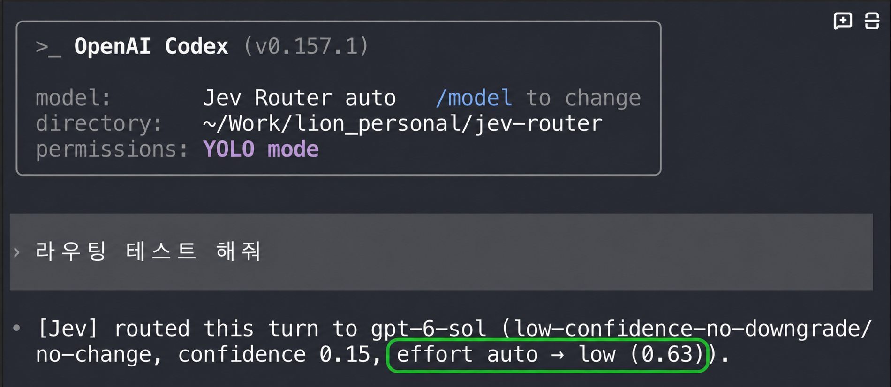

# jev-router

[Open the illustrated story (English / 한국어)](https://htmlpreview.github.io/?https://github.com/must-lioncho/jev-router-effort/blob/master/docs/story.html) · [HTML source](docs/story.html)



Codex shows `effort auto → low (0.63)` on a real turn; [Claude Code shows its model and effort decision too](docs/assets/claude-routing-evidence.png). I built this edition to choose both per turn. The screenshots show decisions, not a benchmark or proof of a market-first claim. [Read the story, diagrams, and next steps →](https://htmlpreview.github.io/?https://github.com/must-lioncho/jev-router-effort/blob/master/docs/story.html)

[한국어 안내](README.kr.md)

[Router Q&A (English)](docs/QNA.md) · [라우터 Q&A (한국어)](docs/QNA-kr.md)

This repository is a derivative of [gargpratyush/jev-router](https://github.com/gargpratyush/jev-router)
by the original Jev Router contributors. We maintain this edition as a non-commercial
project. The MIT license still permits anyone to use, modify, distribute, and fork the
code, including for commercial purposes. See [LICENSE](LICENSE) for the terms.

This edition adds automatic Codex reasoning-effort selection and exposes the effort levels
advertised by the signed-in model catalog. It also fixes Codex model-selection errors by
fetching the account catalog on cold start, filtering incompatible request formats, and
keeping the chosen model and effort for tool continuations.

Automatic per-turn model routing for Claude Code, OpenAI Codex, and AGY (Antigravity CLI).
Each CLI retains its native interface, tools, sessions, permissions, and authentication.

| Command | Interface | Authentication | Routing decision |
| --- | --- | --- | --- |
| `jev-claude` | Claude Code | Existing `claude login` | Status line |
| `jev-codex` | OpenAI Codex | Existing `codex login` | Commentary line |
| `jev-agy` / `jev -A` / `jev-a` / `jev-anti` / `jev-antigravity` | AGY (Antigravity CLI) | Existing AGY login | First streamed line |
| `jev-glm` | ZAI CLI (`glm` / `zai`, z.ai GLM) | Existing z.ai key | First streamed line |

All commands launch the real upstream CLI. Jev chooses a model at the start of each user
turn.

## Quick start

Requires Node.js 20.12+ and at least one supported CLI:
[Claude Code](https://code.claude.com/docs/en/setup),
[OpenAI Codex](https://developers.openai.com/codex/cli), or Antigravity CLI.

### 1. Upstream npm package

The npm package `jev-router` belongs to the original project. To run the changes in this
repository, install from the local repository below.

```bash
npm install -g jev-router
echo "JEV_API_KEY=..." > ~/.jev-router.env
```

### 2. Local repository

```bash
git clone https://github.com/must-lioncho/jev-router-effort.git
cd jev-router-effort
npm install
npm link
echo "JEV_API_KEY=..." > ~/.jev-router.env
```

On Windows PowerShell:

```powershell
Set-Content "$HOME\.jev-router.env" "JEV_API_KEY=..."
```

Get a key from [TypeSafe](https://docs.typesafe.ai). Then launch either interface from any
repository:

```bash
jev-claude
jev-codex
jev-agy
```

No Anthropic or OpenAI API key is required when the corresponding CLI is already logged in
with a subscription. Every CLI argument is forwarded:

```bash
jev-claude --resume
jev-claude -p "fix the failing test"
jev-codex resume --last
jev-codex exec "fix the failing test"
```

For a local checkout, `npm link` installs the commands. Without it, run
`node bin/jev-claude.mjs` or `node bin/jev-codex.mjs`.

## Antigravity (`jev-agy`)

`jev-agy` opens AGY's native terminal UI with **Jev Router (auto)** selected in `/model`.
`jev -A`, `jev-a`, `jev-anti`, and `jev-antigravity` are aliases. Selecting another model in
the picker pauses routing; selecting **Jev Router (auto)** resumes it. `-p`/`--print` prompts
are routed the same way.

Each fresh decision is the first line of the answer. It appears as soon as Jev decides
(about 0.5 s), before the model's first token, which can take much longer:

```text
[Jev] routed this turn to gemini-3.1-pro-low (jev, confidence 0.32).
```

Jev chooses among the exact IDs in the signed-in account's agent picker, such as
`gemini-3.8-flash-low`, `gemini-3.1-pro-low`, `claude-sonnet-4-6`, or `gpt-oss-120b-medium`.
AGY encodes the thinking level in the ID (`-low`, `-medium`, `-high`), so the chosen ID also
sets the effort. Tool continuations keep the turn's model. Jev's notes are removed from the
conversation history before each request, so the model never reads them.

AGY reads its API server from `CLOUD_CODE_URL`. `jev-agy` sets it for the child process only;
a value you already exported becomes the proxy's upstream. AGY subcommands such as
`jev-agy models` run without the proxy. Nothing in AGY's installation, `settings.json`, or
`config.json` is changed.

## GLM (`jev-glm`)

`jev-glm` opens the ZAI CLI (the `glm` launcher when present, otherwise `zai`) and routes each
user turn between `glm-5.3-flash`, `glm-5.2`, and `glm-5.3`, and sets z.ai's
`reasoning_effort` to `low`, `high`, or `max`. The CLI's own picker only lists
glm-4.6/4.5/4.5-air, so the proxy rewrites the model; the coding endpoint serves all three
routed models. Tool continuations keep the turn's model and effort. Turning thinking off
(`T`) stops the proxy from sending `reasoning_effort`.

The ZAI CLI renders nothing until a model stream has fully ended, so a streamed note would
only show with the answer. Instead the proxy answers each new turn with a synthetic `bash`
call, `echo '[Jev] routed this turn to glm-5.3 (jev, confidence 0.71, effort max (0.90)).'`,
which the CLI runs and shows as soon as Jev decides (about 0.4 s). The CLI then sends the
echo's result back, the proxy removes that exchange from the history, and the real request
goes to the routed model, so the model never reads the note. The decision is also written
to the terminal tab title.

## Claude Code interface


`jev-claude` launches Claude Code with **Jev Router (auto model + effort)** selected in `/model`.
Selecting another model pauses routing; selecting **Jev Router** resumes it. Jev chooses
`low`, `medium`, or `high` effort for each turn and holds that choice through tool calls.
Claude Code's built-in effort picker cannot add an `auto` row: the Jev Router model entry is
the auto switch. Its native effort indicator shows the CLI setting, while Jev's status line
shows the effort sent to the API.

The first line of a streamed answer shows the decision:

```text
[Jev] routed this turn to claude-sonnet-5 (jev, confidence 0.91, effort auto → low).
```

The line appears when the upstream API starts a successful response; routing cannot make a
slow model response or shell command finish sooner. If Jev fails, the proxy keeps Claude
Code's current effort setting.

The injected status line shows the model used for the last turn:

```text
⚡ haiku · effort auto → low (p=0.98) · my-project · 8% context
⏸ manual Opus 4.6 · my-project · 21% context
```

Claude Code otherwise remains unchanged, including its keybindings, tools, permission prompts,
`/compact`, `/resume`, and session handling. An existing custom `statusLine` is preserved;
set `JEV_NO_STATUSLINE=1` to disable Jev's status line.

The explanation skill is bundled with the npm package and loaded automatically: run
`/jev-explain` in `jev-claude`, or `$jev-explain` in `jev-codex`, to see the factors behind
the last routing decision:

```text
┌─────────────────────────────────┐
│ Jev Router                      │
│                                 │
│ Jev request                     │
│ Prompt: explain the router      │
│ Current tier: HAIKU             │
│ Context tokens: 6200            │
│                                 │
│ Jev response                    │
│ Task complexity     0.82        │
│ Reasoning required  0.91        │
│ Tool complexity     0.64        │
│ Context size        0.31        │
│                                 │
│ Recommended tier: SONNET        │
│ Selected model: SONNET          │
│                                 │
│ Confidence: 94%                 │
│ Decision: Jev recommendation    │
└─────────────────────────────────┘
```

The report is rendered locally from the exact prompt, System One request, and System One
response saved when routing occurred. Recent decisions are retained per CLI session; invoking
the explanation skill does not ask Jev to score the prompt again.

### Explanation data location

Both `jev-claude` and `jev-codex` keep up to 20 recent routing exchanges in one JSON file per
CLI session under Node.js's operating-system temporary directory:

| Platform | Default location |
| --- | --- |
| Windows | `%TEMP%\jev-claude\<session-id>.json` |
| macOS | `$TMPDIR/jev-claude/<session-id>.json` (normally under `/var/folders/.../T`) |
| Ubuntu/Linux | `${TMPDIR:-/tmp}/jev-claude/<session-id>.json` |

Print the exact directory selected on the current machine with:

```bash
node -e "console.log(require('node:path').join(require('node:os').tmpdir(), 'jev-claude'))"
```

Claude filenames use Claude Code's session UUID. Codex filenames use
`codex-<jev-codex-process-id>.json`. These temporary files contain prompt text and Jev's exact
request and response, so they are readable only by you (the directory is created with mode 700 and each
file with 600). Files not updated for 7 days are deleted automatically, and the operating system
may also remove them during normal temporary-file cleanup.

> Choosing a model with `Enter` can save it as Claude Code's default. `jev-claude` restores
> the previous default on exit so `jev-router` cannot break plain `claude`.

## OpenAI Codex interface


`jev-codex` launches Codex with a temporary **Jev Router** provider and selects `jev-router`.
The native `/model` picker still contains the models available to the account. Selecting a
concrete model pauses routing; selecting **Jev Router** resumes it.

Each fresh decision appears as Codex commentary:

```text
[Jev] routed this turn to gpt-5.6-sol (jev, confidence 0.91, effort high (0.86)).
```

For Codex, reasoning effort defaults to `auto`, which lets Jev choose the lowest sufficient
API effort supported by the selected model, including `max` when advertised. The native
picker also offers `ultra` when the account's catalog advertises it. Ultra is a Codex mode
for automatic task delegation, not an API reasoning effort: Codex enables the mode and
converts its effort before sending a request. Jev preserves that manual selection but does
not choose Ultra in `auto` mode or send it as an API effort. Tool continuations stay pinned
to the model and effort selected for that turn.

`jev-codex` installs or refreshes the packaged `$jev-explain` skill when it starts, so it is
available from any repository without separate setup.

Codex's footer shows `jev-router` because it displays the selected picker entry,
not the model chosen behind that provider. If Jev is unavailable, the commentary names the
fallback model and explains how to set `JEV_API_KEY`.

## How it works

Each command starts a loopback proxy, launches the real CLI, and forwards the CLI's existing
authorization headers without reading, storing, or modifying them.

```text
you -> Claude Code -> jev-claude proxy -> Anthropic
                         |
                         +-> Jev: choose a tier

you -> OpenAI Codex -> jev-codex proxy -> OpenAI
                         |
                         +-> Jev: choose a tier

you -> AGY -> jev-agy proxy -> Google Cloud Code
                 |
                 +-> Jev: choose an exact model
```

Claude Code uses `ANTHROPIC_BASE_URL`; Codex uses a temporary custom provider with
`requires_openai_auth=true`; AGY uses `CLOUD_CODE_URL`, and the proxy adds `jev-router` to
AGY's `fetchAvailableModels` reply so the native picker shows it. All three use `jev-router`
as the routing sentinel.
Any concrete model selected by the user passes through unchanged.

## Routing policy

One Jev call per fresh user turn selects a shared abstract tier:

| Tier | Claude Code default | Codex default |
| --- | --- | --- |
| Fast | Haiku | `gpt-5.6-luna` |
| Balanced | Sonnet | `gpt-5.6-terra` |
| Strong | Opus | `gpt-5.6-sol` |
| Long | Fable | `gpt-6-astra` |

`src/policy.mjs` then applies these rules:

- explicit requests such as `use opus`, `use luna`, or `use strong` win;
- failure, timeout, or an unrecognised Jev answer keeps the current model;
- low confidence never downgrades and caps upgrades at the balanced tier;
- large conversations refuse downgrades that would waste more prompt-cache work than they save;
- unavailable tiers step upward rather than silently choosing a weaker model;
- the long tier is disabled unless `JEV_ALLOW_FABLE=1`.

Tool-loop continuations keep the tier chosen at the start of the turn. Main conversations and
sub-agents are pinned separately. Routing is fail-open: Jev failure never blocks the CLI.

## Configuration

| Variable | Interface | Effect |
| --- | --- | --- |
| `JEV_API_KEY` | All | Enables routing. `TYPESAFE_API_KEY` also works. |
| `JEV_ALLOW_FABLE` | All | Enables the opt-in long tier. |
| `JEV_DEBUG` | All | Logs decisions and rewrites to `~/.jev-claude.log` in interactive sessions. |
| `JEV_DUMP` | All | Dumps request bodies for debugging wire-format changes. |
| `JEV_NO_STATUSLINE` | Claude | Disables the injected Claude status line. |
| `JEV_CODEX_FAST_MODEL` | Codex | Fast model; defaults to `gpt-5.6-luna`. |
| `JEV_CODEX_BALANCED_MODEL` | Codex | Balanced model; defaults to `gpt-5.6-terra`. |
| `JEV_CODEX_STRONG_MODEL` | Codex | Strong model; defaults to `gpt-5.6-sol`. |
| `JEV_CODEX_LONG_MODEL` | Codex | Long model; defaults to `gpt-6-astra`. |

Existing environment variables have highest precedence, followed by `.env` in the launch
directory, `~/.jev-router.env`, and the legacy `~/.jev-claude.env`.

Tier definitions, Jev's question, confidence thresholds, and timeouts live in `src/config.mjs`.
Both launchers send Jev the exact models in the signed-in account's native catalog, so model
versions such as `claude-opus-4-8` and `claude-opus-5` remain separate choices. Static model
ids are used only until the CLI fetches its catalog.

## Compatibility notes

- Claude Code needs schema normalisation for older MCP JSON Schema fields when a custom base
  URL is active.
- Claude request fields unsupported by a routed tier, such as adaptive thinking on Haiku,
  are removed before forwarding.
- Codex's current request format stores tool definitions inside its Responses API input.
- Codex's ChatGPT backend may stream SSE without a `Content-Type` header; the proxy detects
  the event stream from its first frame.
- Codex workspace-specific enterprise origins are internal to its built-in provider and
  cannot be reproduced by a custom provider.

## Development

```bash
npm install
echo "JEV_API_KEY=..." > .env

npm test
node test/live-routing.mjs
node bin/jev-claude.mjs -p "what is 2+2?"
node bin/jev-codex.mjs exec "what is 2+2?"
```

The test suite covers shared policy, both request formats, model rewriting, capability
handling, settings restoration, Codex authentication forwarding, native model-picker
injection, and decision display.

## Limitations

- The user's prompt text is sent to TypeSafe for the routing decision. Nothing else is.
- Jev adds latency only to the first request of a turn; tool-loop continuations add none.
- Claude Code and Codex request formats are not public contracts. Use `JEV_DUMP` to diagnose
  upstream changes.
- Developed and tested on Windows against Claude Code v2.1.101 and OpenAI Codex v0.154.0.

## Contributing

Report issues and propose changes in [this edition's issue tracker](https://github.com/must-lioncho/jev-router-effort/issues).
Include your CLI version, steps to reproduce, and logs with secrets removed. Run `npm test`
before opening a pull request. For changes to the original project, use the
[upstream issue tracker](https://github.com/gargpratyush/jev-router/issues).

## License

[MIT](LICENSE). This edition is maintained for non-commercial purposes, but the license
does not restrict commercial use. Keep the original copyright and license notice when
redistributing the code.
